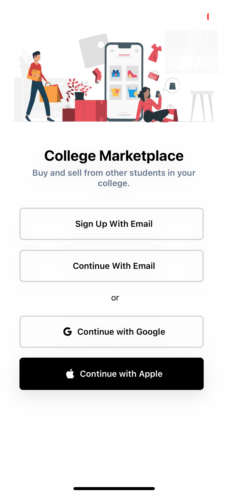

## Overview

Student Hub is a community marketplace for college and university students to buy and sell second-hand goods, fostering a sustainable and affordable exchange of textbooks, furniture, electronics, and other essentials within the student community.

### Project structure
```
├── api
│   ├── cmd
│   ├── config
│   ├── db
│   └── internal
└── client
    ├── App.js
    ├── Apps
    ├── assets
    ├── hooks
    ├── package.json
    └── tsconfig.json
```

### Tech Stack


| **Front-End**  | **Back-End** | **Database** | **BaaS** |
|--------|--------|--------|--------|
| React Native | Go | MongoDB | Firebase | 

### Screenshots

<div style="display:flex;" >

