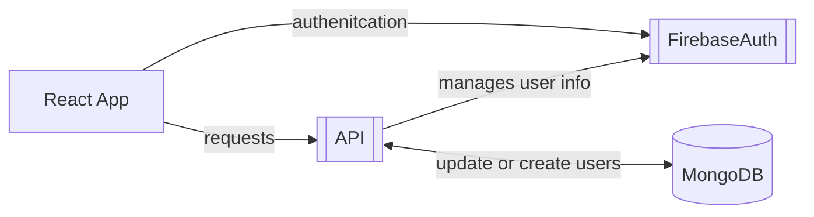
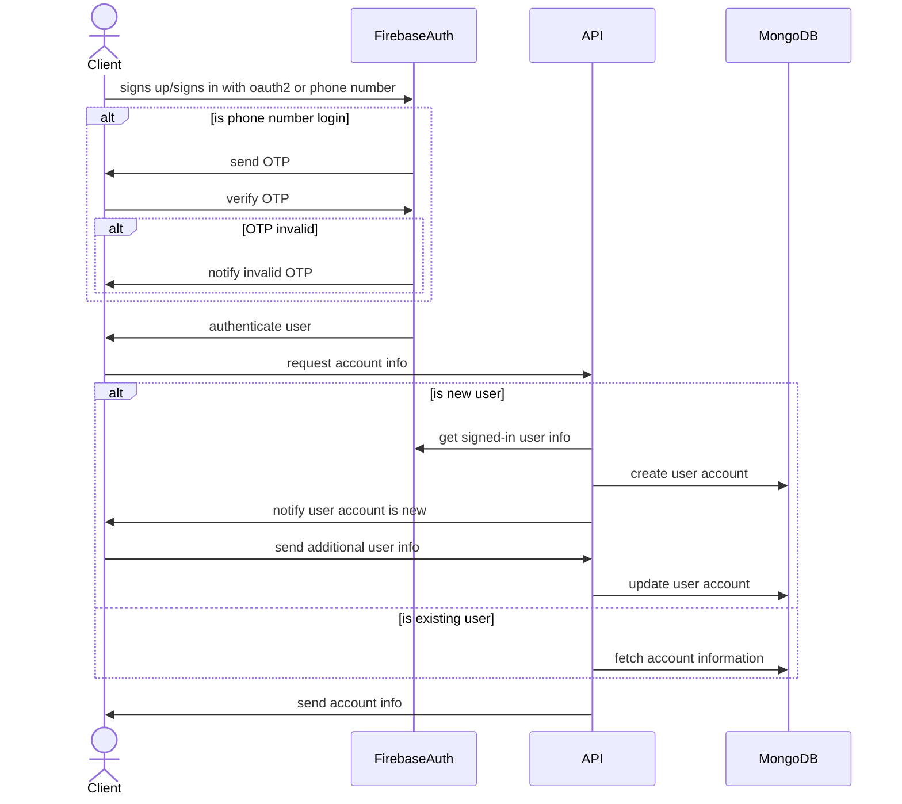

## Overview
Student Hub is a community marketplace for college and university students to buy and sell second-hand goods, fostering a sustainable and affordable exchange of textbooks, furniture, electronics, and other essentials within the student community.

## User Interface
#### Onboarding Screens
| Welcome  | Login | Sign Up |
|--------|--------|--------|
|  |  |  | 

## Folder Structure & Tech Stack
The folder structructe follows the convetions of Go & React Native applications as depicted below:
```
├── api
│   ├── cmd
│   ├── config
│   ├── db
│   └── internal
└── client
    ├── App.js
    ├── Apps
    ├── assets
    ├── hooks
    ├── package.json
    └── tsconfig.json
```
The tech stack is made up of React Native & Golang as depicted below:

| **Language**  | **Framework** |
|--------|--------|
| Javascript | React Native |


| **Language**  | **Framework** |
|--------|--------|
| Go | Fiber |

|  **Database** | **BaaS** |
|--------|--------|
| MongoDB | Firebase | 


## Authentication & Authorization
The Student-Hub will be using Firebase as a provider for handling OAuth 2.0 and phone number authetication. Below is a high level overview of the flow between the client, API & Firebase:



#### Sign in/Sign up Sequence Diagram
