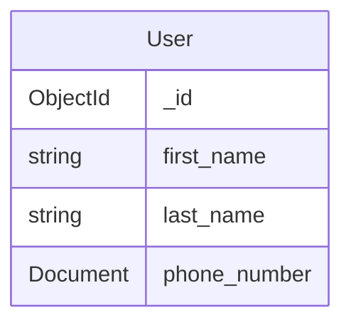

## Configuring development environment

### 1. Install Go
Follow the instructions on this link to [Download and install Go](https://go.dev/doc/install).

**Note**: macOS needs the following lines to be added to the .zshrc file:
```
export GOPATH="$HOME/go"
PATH="$GOPATH/bin:$PATH"
```
This will allow to for usage of `go <command>` on the terminal

### 2. Run the Go program
Open VS Code, select **Run and Debug** and run **student-hub-api**

## Data Models

The API models the data to be persisted on MongoDB.

Below is a list of er diagrams for the models:
